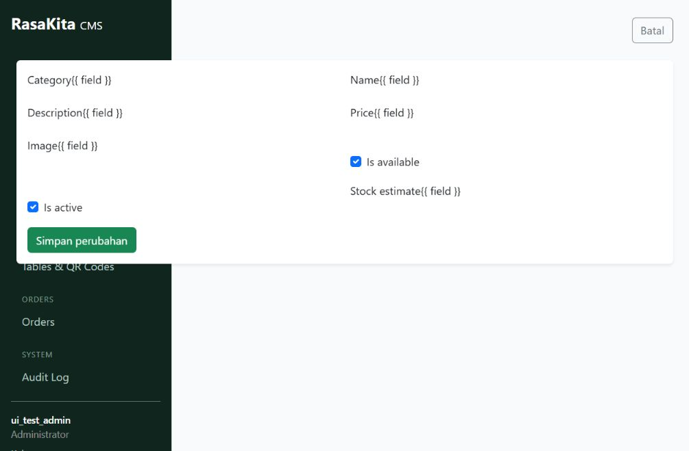
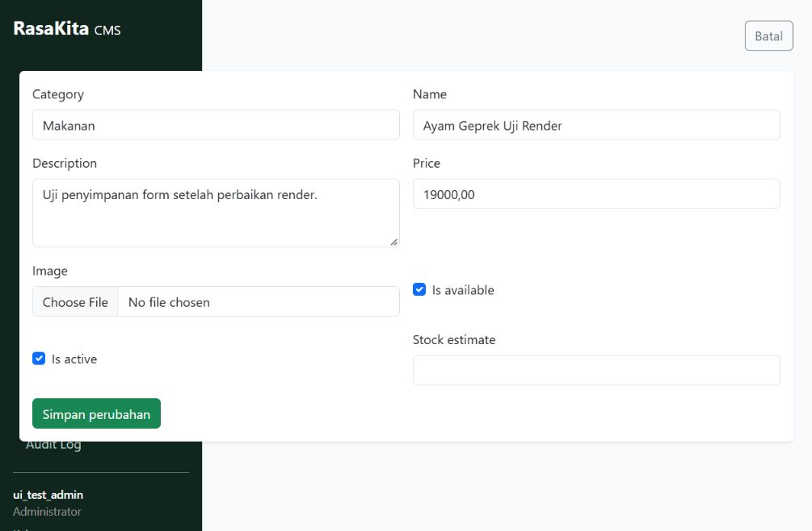
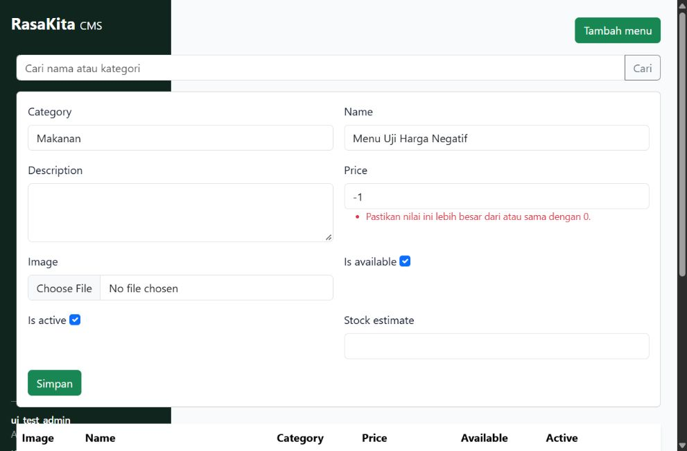
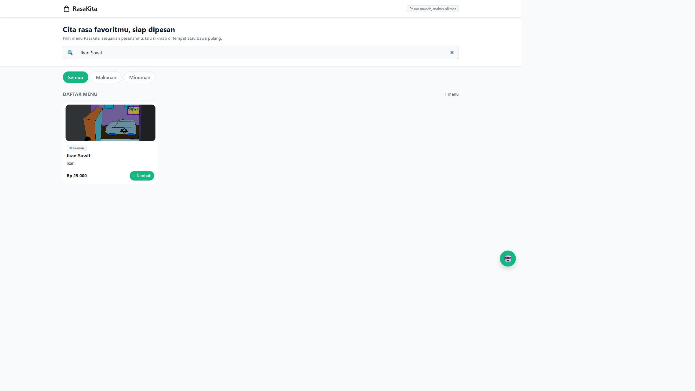

# Dokumentasi Perbaikan Form CMS dan Gambar Menu

Tanggal dokumentasi: 10 Oktober 2026. Kontribusi: Ahmad.

Perbaikan tercatat pada commit `95c8d8d3d832b2c8586c1b65b66bd43b99203a59` dengan pesan `fixing users/menu_items: menambahkan pesan error dan upload gambar`. Dokumentasi ini dibuat setelah commit tersebut dan pembaruan dari tim.

## 1. Tujuan dan batas pekerjaan

Memperbaiki tampilan form pengelolaan menu agar admin dapat mengisi, memvalidasi, dan menyimpan data, serta memastikan gambar unggahan tampil pada katalog pengguna.

Pekerjaan ini tidak menambah fitur tag atau hapus menu. Tidak ada perubahan schema, migrasi, atau dependency untuk kedua perbaikan. Modul cart, orders, dan layanan rekomendasi tidak diubah dalam pekerjaan ini.

## 2. Perilaku sebelum dan sesudah

| Bagian | Sebelum | Sesudah |
| --- | --- | --- |
| Form edit CMS | Sebagian ekspresi `{{ field }}` tampil sebagai teks karena terpotong baris dalam template. | Ekspresi ditulis utuh sehingga kolom input dirender. |
| Pesan validasi | Pesan kesalahan pada form tambah tidak tampil dengan benar; panel dapat tertutup setelah gagal. | Kesalahan tiap kolom dan kesalahan umum ditampilkan; panel tambah tetap terbuka ketika form memiliki kesalahan. |
| Label input | Label belum terhubung secara eksplisit dengan input. | Atribut `for` menggunakan `field.id_for_label`. |
| Gambar unggahan | URL gambar tidak mengarah ke berkas yang dapat diakses, sehingga katalog menampilkan gambar pengganti. | Berkas disimpan di `media/` dan diakses melalui `/media/` pada server development. |

Perbaikan validasi berada pada penyajian pesan. Aturan validasi dan proses simpan yang sudah ada tetap digunakan.

## 3. File yang diubah

| File | Tujuan perubahan |
| --- | --- |
| `users/templates/users/form.html` | Memperbaiki render input, menghubungkan label, dan menampilkan kesalahan umum form. Template ini dipakai bersama oleh beberapa halaman edit CMS. |
| `users/templates/users/menu_items.html` | Memperbaiki render input dan pesan kesalahan serta membuka panel tambah ketika validasi gagal. |
| `config/settings.py` | Menetapkan `MEDIA_URL = '/media/'` dan `MEDIA_ROOT = BASE_DIR / 'media'`. |
| `config/urls.py` | Menambahkan penyajian berkas media untuk development melalui helper Django `static()`. |
| `.gitignore` | Mengabaikan folder `media/` agar unggahan lokal tidak ikut dilacak Git. |

Saat verifikasi, lima tes perbaikan ditambahkan sementara di `users/tests.py` dan berhasil dijalankan. Pada kondisi proyek saat dokumentasi dibuat, tes tersebut sudah tidak ada; file itu kini berisi `CashierAreaTests` dari pembaruan tim. Dokumentasi ini tidak mengembalikan atau mengubah tes tim.

Commit perbaikan juga memuat `menu/image_24.png`. Berkas itu merupakan unggahan lama, bukan kode perbaikan. Aturan ignore `media/` tidak mencakup berkas yang sudah dilacak di folder `menu/`.

## 4. Cara kerja dan kaitan OOP

Kelas yang digunakan sudah tersedia sebelum perbaikan:

- `MenuItem` di `menu/models.py` mewakili data menu. `ImageField(upload_to="menu/")` menyimpan nama/path gambar; isi berkas disimpan melalui sistem storage Django.
- `MenuItemForm` di `users/forms.py` mewarisi `BootstrapModelForm`, yang mewarisi `forms.ModelForm`. Ini merupakan contoh inheritance yang sudah ada: form menu menggunakan perilaku validasi dan penyimpanan ModelForm serta penyesuaian tampilan dari kelas induknya.
- `BootstrapModelForm.__init__()` memakai `super()` dan memberi kelas CSS sesuai jenis widget. Perbaikan template menampilkan widget tersebut melalui `{{ field }}`.
- `_save_form()` di `users/views.py` adalah fungsi, bukan method kelas. Fungsi ini menerima `request.POST` dan `request.FILES`, memanggil `form.is_valid()`, lalu menyimpan form yang valid.

Tidak ada kelas atau hierarki OOP baru pada perbaikan ini. Pekerjaan ini memperbaiki template dan konfigurasi media, bukan penerapan tambahan empat pilar OOP.

## 5. Contoh alur konkret

Admin membuka Edit Menu, mengisi harga Rp19.000, memilih gambar PNG, lalu menekan Simpan perubahan. Form multipart mengirim data teks dan berkas ke view. `MenuItemForm` memvalidasi input; jika valid, data menu disimpan dan gambar ditempatkan di `media/menu/`.

Katalog membaca `/api/menu/`. Serializer yang sudah ada menggunakan `item.image.url`, sehingga alamat menjadi seperti `/media/menu/nama-gambar.png`. Browser mengambil berkas tersebut dan menampilkannya pada kartu menu.

Jika admin memasukkan harga `-1`, form ditolak oleh validasi yang sudah ada. Pesan kesalahan tampil dan input tetap tersedia untuk diperbaiki; data edit yang tersimpan tidak berubah.

## 6. Hasil verifikasi dan batasnya

Hasil berikut berasal dari sesi perbaikan sebelum commit dan pembaruan tim, bukan eksekusi ulang pada saat penulisan dokumentasi:

| Pemeriksaan | Hasil |
| --- | --- |
| Render form edit menu, kategori, dan add-on | Input HTML tampil; ekspresi template tidak tampil sebagai teks. |
| Tambah menu dengan harga negatif | Ditolak, pesan tampil, panel tetap terbuka, data invalid tidak dibuat. |
| Edit invalid | Input dipertahankan dan data tersimpan tidak berubah. |
| Edit valid | Nama, harga, deskripsi, dan stok berhasil disimpan. |
| Unggah gambar | Berkas tersimpan dan API mengembalikan URL `/media/menu/...`. |
| Lima tes terkait | Lulus pada saat perbaikan; tes tersebut tidak tersedia dalam versi file saat ini. |
| Pemeriksaan Django dan whitespace diff | Lulus pada saat perbaikan. |
| Browser | Form dan validasi dicoba pada database salinan di port 8001. Gambar berhasil dimuat pada katalog port 8000 dan 8001. |

Pengujian otomatis menggunakan database sementara. Pengujian form yang mengubah data melalui browser menggunakan database salinan `.venv/ui-test.sqlite3`. Hasil ini tidak membuktikan seluruh aplikasi bebas bug, dan integrasi terbaru dari tim belum diuji ulang dalam tugas dokumentasi ini.

### Bukti tampilan

Sebelum perbaikan render form:



Setelah perbaikan render form:



Validasi form tambah:



Gambar unggahan pada katalog:



## 7. Cara mencoba

Dari folder proyek dengan lingkungan yang sudah terpasang, jalankan:

```powershell
.\.venv\Scripts\python.exe manage.py check
.\.venv\Scripts\python.exe manage.py runserver 127.0.0.1:8000
```

1. Buka `http://127.0.0.1:8000/staff/` dan masuk menggunakan akun staf yang berwenang.
2. Buka Menu Items, pilih menu percobaan, lalu buka Edit.
3. Pastikan input tampil. Masukkan harga negatif untuk mencoba penolakan validasi. Browser mungkin menolak lebih dahulu; pengujian otomatis sebelumnya juga mengirim input invalid langsung ke server.
4. Isi harga valid, pilih gambar, lalu simpan.
5. Buka katalog `/`, cari menu tersebut, dan pastikan gambar unggahan tampil.
6. Coba form Tambah Menu dengan input tidak valid dan periksa pesan serta panelnya.

Gunakan data percobaan atau database salinan untuk langkah yang menyimpan perubahan. Jangan menjalankan migrasi atau seed ulang hanya untuk mencoba perbaikan ini.

## 8. Keterbatasan dan tindak lanjut

- Penyajian media melalui helper `static()` berlaku pada development dengan `DEBUG=True`. Deployment membutuhkan pengaturan penyajian media tersendiri.
- Gambar merupakan berkas terpisah dari database. Memindahkan database saja tidak memindahkan gambar; berkas media juga perlu disalin atau dicadangkan.
- Unggahan lama berada di folder `menu/`; pada sesi perbaikan, dua berkas lama disalin ke `media/menu/` tanpa menghapus sumber atau mengubah referensi database.
- Menu tanpa gambar atau gambar yang gagal dimuat tetap memakai gambar pengganti dari frontend.
- Jika ingin mempertahankan pemeriksaan otomatis perbaikan ini, tambahkan kembali tes terkait sambil menjaga `CashierAreaTests` milik tim.
- Fitur tag menunggu tugas berikutnya. Fitur hapus menu dikeluarkan dari lingkup sesuai keputusan pengguna.

## 9. Checklist review dan commit

- [ ] Form edit menampilkan input dan label yang sesuai.
- [ ] Form invalid menampilkan pesan dan tidak menyimpan data invalid.
- [ ] Edit valid menyimpan perubahan.
- [ ] Gambar unggahan tampil pada katalog.
- [ ] Berkas media lokal tidak dimasukkan sebagai kode.
- [ ] Perubahan dari anggota lain tetap dipertahankan.

Commit perbaikan sudah tercatat di atas. Usulan pesan untuk commit dokumentasi ini: `docs: dokumentasikan perbaikan form CMS dan gambar menu`. Tidak ada commit atau push yang dijalankan dalam tugas dokumentasi ini.

## 10. Pertanyaan pemahaman

1. Mengapa memperbaiki `{{ field }}` pada template dapat memunculkan kembali kolom input tanpa mengubah model?
2. Apa perbedaan fungsi `MEDIA_ROOT` dan `MEDIA_URL` pada alur gambar menu?
3. Mengapa menghapus tes perbaikan tidak menghentikan aplikasi, tetapi mengurangi kemampuan mendeteksi masalah yang muncul kembali?
